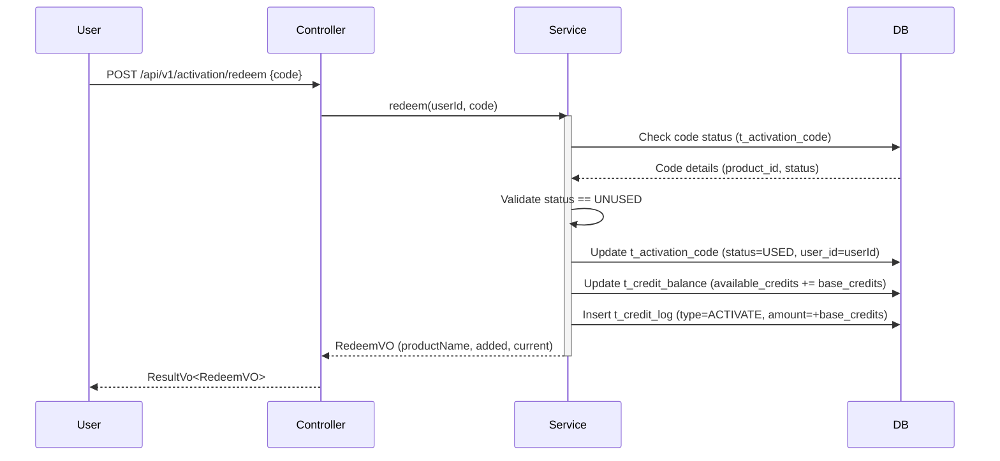

# API Design Specification

## 1. Unified Search DTOs

### SearchRequest
Used for both Product list and Credit log searches.
```java
package base.ecs32.top.api.dto;

import lombok.Data;
import java.util.Map;
import java.util.List;

@Data
public class SearchRequest {
    private Integer current = 1;
    private Integer pageSize = 20;
    private String keyword;
    private Map<String, Object> filter;
    private Map<String, List<Object>> range;
    private SortConfig sort;

    @Data
    public static class SortConfig {
        private String field;
        private String order; // "asc" or "desc"
    }
}
```

### PageResponse
Standard pagination wrapper.
```java
package base.ecs32.top.api.vo;

import lombok.Data;
import java.util.List;

@Data
public class PageResponse<T> {
    private List<T> list;
    private Long total;
    private Integer current;
    private Integer pageSize;
    private Integer pages;

    public static <T> PageResponse<T> of(List<T> list, Long total, Integer current, Integer pageSize) {
        PageResponse<T> response = new PageResponse<>();
        response.setList(list);
        response.setTotal(total);
        response.setCurrent(current);
        response.setPageSize(pageSize);
        response.setPages((int) Math.ceil((double) total / pageSize));
        return response;
    }
}
```

## 2. Activation Code Redemption

### RedeemRequest
```java
package base.ecs32.top.api.dto;

import lombok.Data;

@Data
public class RedeemRequest {
    private String code;
}
```

### RedeemVO
```java
package base.ecs32.top.api.vo;

import lombok.Data;

@Data
public class RedeemVO {
    private String productName;
    private Integer addedCredits;
    private Integer currentBalance;
}
```

## 3. Credit Balance

### CreditBalanceVO
```java
package base.ecs32.top.api.vo;

import lombok.Data;
import java.time.LocalDateTime;

@Data
public class CreditBalanceVO {
    private Integer availableCredits;
    private Integer frozenCredits;
    private LocalDateTime updateTime;
}
```

## 4. Endpoints Definition

### CreditController
- `GET /api/v1/credit/balance`: Returns `CreditBalanceVO`
- `POST /api/v1/credit/logs`: Returns `PageResponse<CreditLog>`

### ActivationController
- `POST /api/v1/activation/redeem`: Returns `RedeemVO`

### ProductController
- `POST /api/v1/product/list`: Returns `PageResponse<Product>`

## 5. Transaction Logic (Activation Redemption)
The `ActivationCodeService.redeem` method must be annotated with `@Transactional`.

### Redemption Workflow


## 6. Unified Query Utility
A utility class `QueryWrapperUtils` will be created to convert `SearchRequest` to MyBatis Plus `QueryWrapper`.
- `keyword`: Applied as `LIKE` across multiple relevant fields (e.g., product name/desc).
- `filter`: Applied as `EQ`.
- `range`: Applied as `GE` and `LE`.
- `sort`: Applied as `orderBy`.
