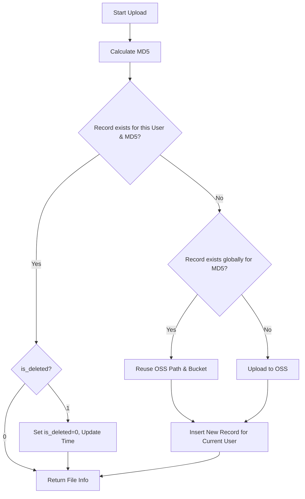

# Plan: File MD5 Uniqueness and Fast Upload Implementation

This plan addresses the requirement to handle duplicate file uploads based on MD5. It ensures that:
1. Users don't re-upload the same file if they already have it (restoring if deleted).
2. The system doesn't re-upload the same file to OSS if it already exists globally (deduplication).
3. Each user can maintain their own metadata for the same file.

## 1. Database Schema Changes
- Modify `t_file` unique index:
    - Drop `uk_file_md5`.
    - Add `uk_user_file_md5` on `(user_id, file_md5)`.

## 2. Service Implementation Refinement (`FileServiceImpl.uploadFile`)
The logic will be updated as follows:

1. **Calculate MD5**: Get the MD5 hash of the uploaded file bytes.
2. **User-Level Check**:
    - Query `t_file` for a record where `user_id = :userId` AND `file_md5 = :md5`.
    - If found:
        - If `is_deleted = 1`, set `is_deleted = 0` and update `update_time`.
        - Return existing file info (Fast Upload / Restore).
3. **Global-Level Check (Deduplication)**:
    - If no user-specific record exists, query `t_file` for *any* record where `file_md5 = :md5` (regardless of `user_id` or `is_deleted`).
    - If found:
        - Copy the `oss_path` and `bucket_name` from the existing record.
        - Create a new database record for the current user with this `oss_path`.
        - Skip the actual OSS upload.
    - If NOT found:
        - Proceed with standard OSS upload.
        - Create a new database record.

## 3. Implementation Steps
1. **Schema Update**: Execute SQL to modify the unique index.
2. **Logic Update**: Modify `uploadFile` in [`FileServiceImpl.java`](api/src/main/java/base/ecs32/top/api/service/impl/FileServiceImpl.java).
3. **Verification**: 
    - Upload file A (User 1) -> Fresh upload.
    - Upload file A (User 1) again -> Fast upload (returns existing).
    - Delete file A (User 1), then upload again -> Restores record.
    - Upload file A (User 2) -> Fast upload (reuses OSS path, creates new DB record for User 2).

## 4. Mermaid Diagram

