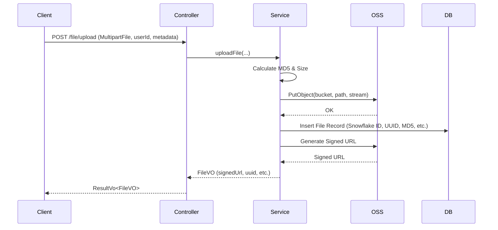

# File System Implementation Plan

## 1. Database Schema
The `file` table will be created to store metadata and OSS references.

```sql
CREATE TABLE IF NOT EXISTS `file` (
    `id` BIGINT NOT NULL COMMENT 'Primary Key (Snowflake ID)',
    `file_uuid` VARCHAR(64) NOT NULL COMMENT 'Business Unique ID',
    `file_md5` VARCHAR(64) NOT NULL COMMENT 'File MD5 hash',
    `user_id` BIGINT NOT NULL COMMENT 'User ID',
    `bucket_name` VARCHAR(100) NOT NULL COMMENT 'OSS Bucket Name',
    `oss_path` VARCHAR(500) NOT NULL COMMENT 'OSS Object Key',
    `file_size` BIGINT NOT NULL COMMENT 'File size in bytes',
    `content_type` VARCHAR(128) NOT NULL COMMENT 'MIME type',
    `metadata` JSON COMMENT 'Business metadata',
    `created_at` DATETIME DEFAULT CURRENT_TIMESTAMP COMMENT 'Creation time',
    `updated_at` DATETIME DEFAULT CURRENT_TIMESTAMP ON UPDATE CURRENT_TIMESTAMP COMMENT 'Update time',
    PRIMARY KEY (`id`),
    UNIQUE KEY `uk_file_uuid` (`file_uuid`),
    INDEX `idx_user_id` (`user_id`),
    INDEX `idx_file_md5` (`file_md5`)
) ENGINE=InnoDB DEFAULT CHARSET=utf8mb4;
```

## 2. Dependencies
Add Aliyun OSS SDK to `pom.xml`.

```xml
<dependency>
    <groupId>com.aliyun.oss</groupId>
    <artifactId>aliyun-sdk-oss</artifactId>
    <version>3.17.4</version>
</dependency>
```

## 3. Architecture

### Entity (core module)
- `base.ecs32.top.entity.File`: MyBatis-Plus entity.

### Data Access (core module)
- `base.ecs32.top.dao.FileMapper`: MyBatis-Plus mapper.

### DTOs (api module)
- `base.ecs32.top.api.vo.FileVO`: Response object.
- `base.ecs32.top.api.dto.FileQueryRequest`: Request body for query, update, delete.

### Service Layer (api module)
- `base.ecs32.top.api.service.FileService`: Interface for the 4 operations.
- `base.ecs32.top.api.service.impl.FileServiceImpl`: Implementation handling logic and OSS interaction.

### Controller (api module)
- `base.ecs32.top.api.controller.FileController`: REST endpoints.

## 4. Configuration
Add to `application.yml`:
```yaml
aliyun:
  oss:
    endpoint: oss-cn-hangzhou.aliyuncs.com
    accessKeyId: your_access_key_id
    accessKeySecret: your_access_key_secret
    bucketName: your_bucket_name
```

## 5. Sequence Diagram (Upload)



I have planned the implementation of the file system according to your requirements. I will now request to switch to code mode to begin implementation.
